## Shell

Este programa implementa un shell para Linux en C.

### Desarrollo

Un shell es un bucle en el que se nos muestra el prompt (por ejemplo &> o cualquier otra combinación de caracteres) para indicar que esta esperando la entrada de una orden. La introducimos, la ejecuta, y de nuevo vuelta a esperar la siguiente orden; a no ser que esa orden termine la ejecución.

Así que vamos a incluir la librería estandar de I/O para poder escribir y leer: `#include <stdio.h>`  
Y creamos también el método "main". En su cabecera, se suele especificar un número entero (argc) y un array de char (argv). Se refieren a el número de argumentos con el que se ha invocado el programa y la cadena de texto con la que fue invocado. Por ejemplo, cuando yo desde el terminal hago un sencillo:
```
$ ls /home/emilio
```
El entero vale 2 (el comando y la ruta) y el array de char almacena toda la cadena, es decir "ls /home/emilio". Si a posteriori necesitamos separar las palabras que vienen en la cadena, será nuestra misión.
```
void main (int argc, char * argv[])
{

  while (1)
  {
      printf("\n#->");
  }

}
```
Dentro del método main estaremos por supuesto creando un bucle infinito donde lo único que se hace por ahora es escribir un retorno de carro (es decir, pasar a una línea nueva) mediante "\\n" y el indicador #-> para que el usuario sepa que puede escribir ahí.

Si lo compilas y lo ejecutas, obtendrás este bucle infinito. La compilación se invoca con gcc indicando con el flag "-o" el nombre del ejecutable que queremos generar: 
```
$ gcc shell.c -o shell
``` 
Y como siempre, lo puedes ejecutar así: 
```
$ ./shell
```

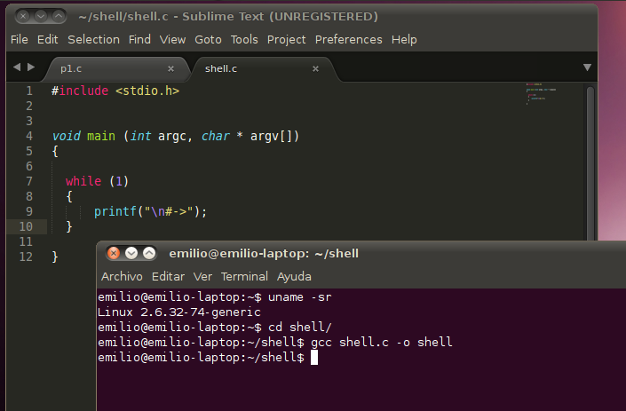

Por ahora vamos a implementar los procedimientos que leen lo que el usuario introduce, sin hacer ninguna operación, y una única orden, que sea la de salida.

Para leer la entrada utilizaré la función fgets (puedes consultarla, acuérdate, con "man fgets"). Su interfaz es la siguiente:
```
char *fgets(char *s, int size, FILE *stream);
```
Así que lee lo que le llegue por el flujo \*stream, desde la posición s hasta la posición size - 1, porque hay que recordar que la máquina empieza a contar posiciones desde el cero. Por eso voy a definir una constante a la que voy a llamar MAXSTR que se corresponde con el tamaño máximo de lo que lea el shell; y una variable "input" donde podamos después almacenar lo leído. Fíjate que el tamaño de la cadena ya lo reservo con "malloc" (y esto evitará unos Buffer Overflow muy chulos). Para comprobar que esto funciona, puedo hacer que el programa me haga eco de lo que yo le escribo, simplemente volcando la variable "input".

Como puedes ver en el pantallazo, el compilador nos avisa que el uso implicito de malloc no es nada ortodoxo, pero lo dejaré así por comodidad. También puedes ver la prueba de cómo se comporta. Ojo con esa línea en blanco antes de saltar al siguiente prompt. En la cadena "input" también va el ENTER que pulsas tras introducir algo y por eso se reproduce de nuevo. También se puede ver cómo por ahora solo puedo cortar la ejecución con Ctrl+C.

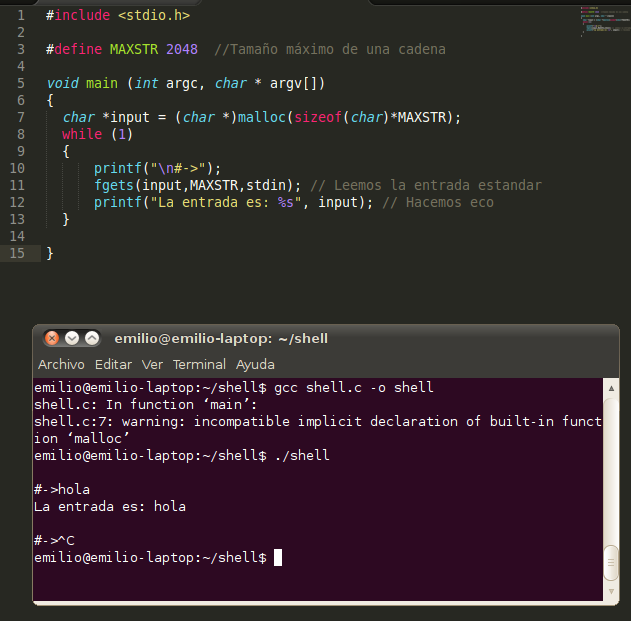

Vamos con el "troceado" de la cadena, para separar lo que serán comandos, de lo que serán argumentos, etc. En el main crearemos una variable (fuera del bucle para no consumir memoria de forma estúpida) llamada "cmdargs" que es un array de chars. Como en C lo que se almacena es un puntero a una dirección de memoria, podemos hacer que cada uno de estos chars sea en realidad aquel donde podamos leer un comando y sus argumento por separado. Y lo que es el troceado en si mismo, lo haremos llamando a una función que he creado aparte llamada readcmdargs, para que sea fácil de entender y no vuelva el código de main muy farragoso. En ella, tomo la cadena "input" y mediante la función strtok busco caracteres como el espacio, el fin de cadena o el tabulador. Si no hay ninguno, la función nos devuelve NULL, lo que quiere decir que el usuario no ha tecleado nada y nuestra funcion devolverá 0; y sino, contaremos cuantos trozos y los iremos almacenando en un array.

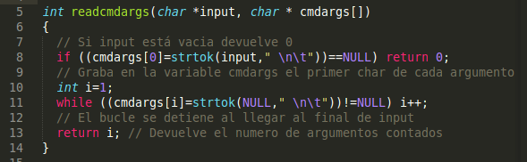

Una vez que la función acaba, main comprueba si ha habido cero trozos (es decir, no se había escrito nada) o si había algo. Y en ese caso por ahora solo escribe que hará lo que nosotros deseemos...

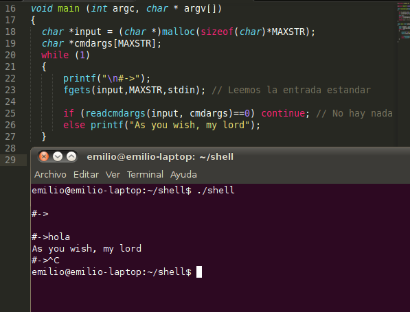

La forma en la que lo he programado sigue arrojando warnings, pero por ahora podemos seguir. Ahora que podemos trabajar de forma lógica con lo que ha escrito el usuario, podemos comparar si lo que ha escrito es una orden que nosotros tengamos implementada. Para ello, voy a olvidarme del "else" en el "if" del main (pues si no se ha escrito nada, nada se hará) y directamente llamo a una función que voy a definir a continuación, llamada cmdcall, encargada de ver qué comando ha escrito el usuario y a continuación llamar a la funcion correspondiente. Por ahora solo voy a permitir dos comandos, que son precisamente los de terminación, bajo los nombres "quit" y "exit". Como en este caso, la terminación no requiere de ningún paso extra, directamente puedo invocar la operacion exit() de C:

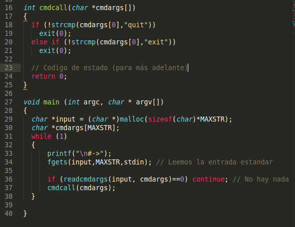

Comprobemos que funciona...

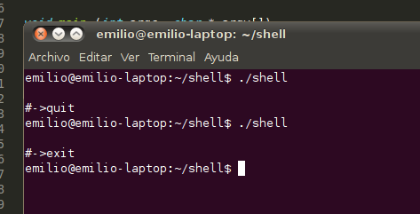

A continuación, vamos a implementar un procedimiento muy sencillo para mostrar el autor, y sabiendo como hacer esto, tres procedimientos más que nos permitan movernos por la estructura de directorios de nuestro sistema y saber en qué directorio nos encontramos. ¡Vamos allá!

En primer lugar atacaremos el procedimiento más sencillo. Quiero que cuando el usuario teclee la orden: `#-> auth` El programa imprima un pequeño texto con mi nombre, el año y la dirección del blog. De modo que en nuestra función "cmdcall", que era donde distinguíamos la orden que ha introducido el usuario, voy a definir que si ha escrito "auth", se llame a la función "printauth". 

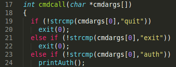 

Sencillo, verdad? Pues ya puedo definir la función "printauth", que sólo son un puñado de "printf": 

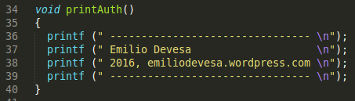

Pasemos a las dos funciones de directorios que quiero implementar. La primera es "pwd" y hace exactamente lo mismo que hace el comando de Linux: muestra en qué directorio estoy. La segunda será "cd" y como la original, me permite cambiar a otro directorio. Voy a añadirlas a mi lista de comandos que ahora tiene esta pinta: 

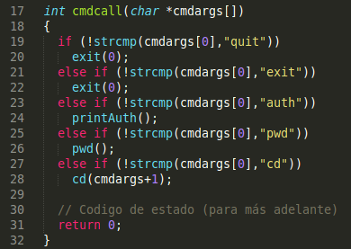

Para implementarlos, voy a utilizar primero un procedimiento adicional, que me devuelve la cadena con la ruta del directorio donde me encuentro. Lo llamaré "cwd" (por las siglas de "Current Working Directory") y su implementación es muy sencilla: creo un buffer de caracteres (voy a aprovechar y darle un tamaño máximo para evitar problemas) y llamo a la función "getcwd" que vuelca en este buffer la ruta local, de nuevo hasta el maximo de caracteres que hemos establecido. Antes de continuar, fíjate en el manual de getcwd: `$ man getcwd` Pertenece a una librería del sistema, de modo que habrá que importarla en la cabecera del programa: `#include <unistd.h>` Ahora que podemos obtener la ruta a partir de esta función, la implementación de pwd es trivial. Basta con almacenarla en una cadena e imprimir su contenido, sin más. Solo debemos vigilar que la función no nos haya devuelto NULL o que haya habido un error; y en ese caso lo enviamos a la salida de errores con "perror". Aquí puedes ver ambas funciones: 

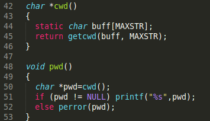

Una vez hecho esto, pasemos a una función con algo más de trabajo. Quiero que el comando "cd" me permita cambiar de directorio, o que no haga nada si no le indico una ruta. Es decir, la cadena con la que se lanza este comando es: `#-> cd [una_ruta]` Donde el argumento de la ruta puede aparecer o no. Por eso, en "cmdcall" lo invocamos pasándole el resto de la orden introducida por el usuario, ya que ahí estarán los argumentos. Vamos a implementarlo.

El procedimiento comienza precisamente preguntando si hay argumentos o no. Si los hay es que el usuario nos ha escrito una ruta y en ese caso llamamos a la función "chdir" (que por suerte también es parte de "unistd.h" indicándole esa ruta. Si el sistema no puede cambiar de directorio (porque la ruta no es valida o el procedimiento provoca un error), lo enviamos a la salida estandar. Un efecto colateral de hacer la llamada a la función dentro del propio if que comprueba su resultado es que, si todo ha ido bien, no necesitamos hacer nada más. Es posible que esto nos arroje algún warning, pero nada grave si entendemos que es por este motivo: 

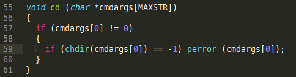

Y habiendo hecho esto, nuestra shell ya está lista para que la compilar y probar: 

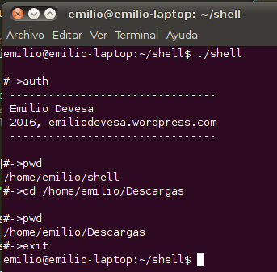

Y ahora que podemos navegar por nuestro árbol de directorios del disco duro, nos prepararemos para listar sus ficheros.

Primero implementaré un par de procedimientos que, dado un ID de usuario o un ID de grupo, me devuelvan ese grupo o usuario. Las funciones a las que debo llamar son "getgrpgid()" y "getpwduid()", y si consulto man, puedo ver que ambas dependen de la libreria "sys/types.h" y luego cada una tiene su propio módulo "grp.h" y "pwd.h": 

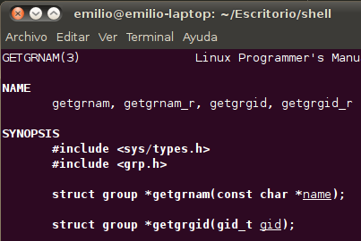

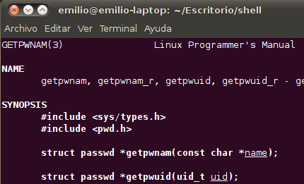

Las ventajas de usar la documentación de man es que además puedo ver un prototipo de las estructuras de datos con las que operan, así que ya se incluso cómo se almacenan grupos y usuarios y qué dato de la estructura debo leer: 

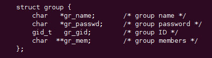 

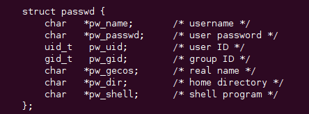

Así que importo esas librerías: 

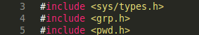

E implemento dos funciones que son la mar de sencillas: 

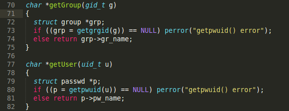 

Son prácticamente análogas: creo una variable para acceder luego a la estructura y con el identificador que recibo como argumento, intento recuperarla. Si recibo un valor NULL, habrá ocurrido un error, y sino ya puedo devolver el campo que me interesa ("gr\_name" o "pw\_name", según sea una u otra).

Una de las características más acertadas del diseño de UNIX (y por extensión, de Linux, OS X, etc.) es que toda entidad es un fichero; y unos bytes de control son los que se encargan de determinar si ese fichero se corresponde con un directorio, un enlace simbólico, una tubería (pipe), un archivo normal y corriente, etc. También otros bytes son los que nos determinan su "modo" o dicho de otra manera, sus permisos. Por eso, cuando desde el terminal lanzas un ls -l ves algo así: 

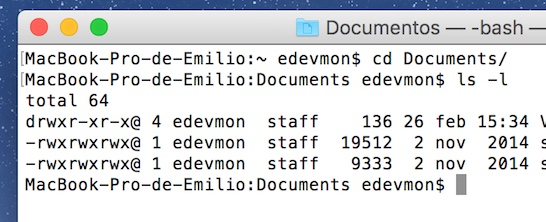

Esta cadena está formada por once caracteres: el de tipo de fichero, los nueve de permisos y el [Sticky bit](https://en.wikipedia.org/wiki/Sticky_bit) si se trata de un directorio.

Vamos a olvidarnos momentáneamente de cómo acceder al modo del archivo en si. Supondremos que nos lo envían como argumento. Vamos a aprovechar el operador "&" de C para hacer una comparación del primer caracter y saber de qué tipo de archivo estamos hablando: 

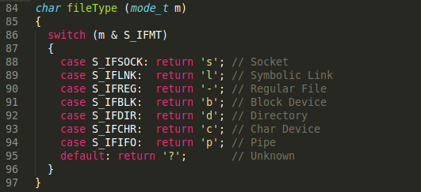 

Esto devolverá el char correspondiente.

Desde otra, conseguiremos el resto de caracteres que nos indiquen los permisos del archivo e iremos dando formato a la cadena "mode": 

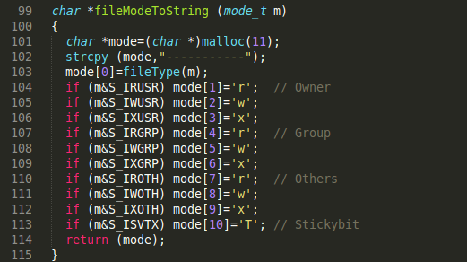 

Como ves, creo una cadena vacía de 11 caracteres y la lleno de guiones. El primer caracter lo establezco llamando a la operación "fileType" que acabamos de escribir. Los demás son simples comparaciones para ver qué permisos están activos. El último es el Sticky bit, que de estar activo se representa generalmente con una T mayúscula. En los sistemas operativos modernos, el Sticky Bit puede indicar incluso más cosas si aparece también en otras posiciones o con la t minúscula pero por simplicidad voy a mantenerlo así en este ejemplo. En el artículo de Wikipedia que he enlazado antes hay mucha más información. Para terminar, la función devuelve la cadena "mode" ya lista.

De acuerdo, si has llegado hasta aquí, tienes suficientes medios como para ir llenando la información de cada línea de ls... excepto porque no hemos aun accedido a los archivos para ver otras propiedades, como su nombre o su tamaño, por ejemplo. Para hacerlo, vamos a recurrir a la función "stat". Puedes consultar más información con: `$ man lstat` Las funciones que hemos escrito y las que nos faltan por crear nos obligan a incluir la librería "sys/stat.h", así que voy a importarla antes de que se me olvide. `#include <sys/stat.h>` Esto si estás trabajando sobre Linux. Hasta ahora nuestra shell también funcionaba sobre OS X, pero la diferencia en la implementación de ambos sistemas y en lo que instalan o no, hace que esta página de man no esté disponible para la manzana (si alguien sabe como hacerlo, agradeceré la información que me podáis dar, porque no he investigado nada sobre el tema).

El caso es que stat nos permite acceder a los ficheros mediante un struct que se detalla en el manual: 

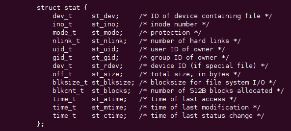 

Así que ya no hay dudas de cómo extraer la información que nos falta. Yo voy a hacer un procedimiento que prepare el string correspondiente, con el modo, el numero de enlaces hacia el elemento, el grupo, el propietario, el tamaño y el nombre de archivo. Este es el código: 

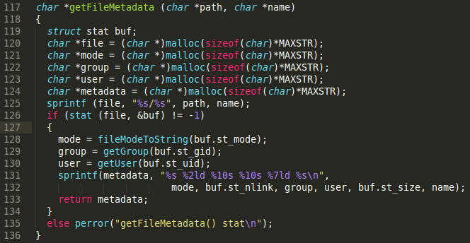 

Comenzamos creando un buffer llamado "buf" que es una estructura donde guardar el acceso al stat con el que manejaremos el fichero. A continuación reservamos los espacios para los strings de modo, grupo y usuario, así como para la linea "metadata", que es la cadena en la que concatenaremos todas las anteriores. A continuación, utilizamos "sprintf" para escribir en la variable "file" la ruta y el nombre del fichero en cuestion (que nos vienen como argumentos del procedimiento) en la forma ruta/nombre. Así tenemos la ruta absoluta, y la necesitamos para hacer "stat" sobre el archivo. Una vez hecho el "stat", ya podemos acceder a los campos st\_mode, st\_guid y st\_uid. Son los que debemos pasarle a las funciones que hemos escrito antes para recuperar el modo, grupo y usuario como cadenas. Una vez hecho, basta con usar "sprintf" para ir formateando la cadena "metadata" con lo que queremos que aparezca. Voy a detenerme un momento en ella, ya que estoy utilizando una forma de formatear la salida en columnas un poco chapucera pero efectiva: 
```
sprintf(metadata, "%s %2ld %10s %10s %7ld %s\n", mode, buf.st_nlink, group, user, buf.st_size, name);
```
Obviamente las máscaras "%s" son las de cadenas de caracteres. El primer string es el de modo, y se coloca sin más. Seguidamente viene un número entero, que es el de número de enlaces hacia ese nodo en el sistema de archivos. Por ser un entero, su máscara es "%d", pero he añadido un 2 para pedir que deje espacio para que se escriban dos dígitos, y una "l" para alinear los números a la derecha; de forma que queden bien colocaditos. Lo mismo pasa con "%10s". Es una máscara para escribir un string reservandole 10 caracteres. Para el tamaño de archivo también he reservado 7, alineados de nuevo a la derecha: "%7ld". No te olvides de incluir el salto de línea al terminar: "\\n". Una vez hecho, ya podemos devolver la cadena "metadata".

Con esto tenemos todo listo para acceder a un fichero y volcar su información en una línea de texto. En Linux disponemos de funciones como "opendir()" y "readdir()" para acceder a un directorio y a sus contenidos. Como puedes ver en el manual, ambas dependen de la librería "dirent" así que vamos a incorporarla a nuestro programa:

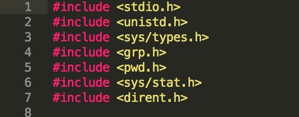 

Además, "readdir()" nos detalla que devuelve una estructura llamada "dirent" que tiene este patrón: 

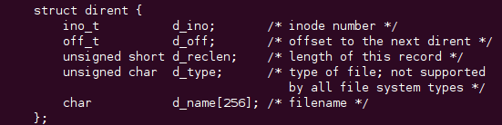

Vamos con la implementación. Por argumentos nos llega lo que escriba el usuario, que puede ser una ruta, el flag "s" (para solo mostrar el nombre de los elementos) y el flag "a" (para mostrar todos los elementos, incluyendo ocultos). Por eso, comenzamos definiendo unas variables que serán las que luego nos permitan ver qué opciones ha activado y qué ruta nos está pidiendo ver. La variable "dir" es la que va a darnos acceso al directorio, y la "dirent" será la que nos permita ir referenciando cada uno de sus archivos o carpetas. El string "path" será la ruta a listar.

Lo que haremos será un bucle que recorra los argumentos con los que "ls" ha sido invocado para comparar si alguno se corresponde con "-s" o "-a", y ponemos el valor de las variables "simple" y/o "all" a 1. Si nos encontramos algo más, será una ruta. Si no hay más argumentos o si no había ninguno, le asignaremos el directorio actual llamando a la función "cwd" que habíamos programado en la segunda parte de esta serie. 

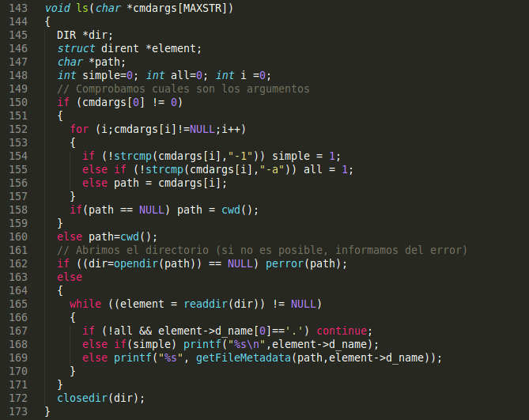 

La segunda parte de la función es muy sencilla de entender. Intentamos abrir el directorio (lanzamos un error si no es posible). Ahora, cada vez que invoquemos "readdir()", se nos devolverán de forma secuencial los elementos que contenga, así que hagamos un bucle para recorrerlos todos hasta que la función devuelva NULL, que significa que ya no quedan más elementos. Con el "if" nos saltamos los archivos que empiecen por un punto (es decir, los archivos ocultos o los enlaces al directorio actual y superior) si la variable "all" no está activada; y si la variable "simple" lo está, entonces solo hacemos un printf con el nombre de la entrada (accesible mediante la estructura dirent que hemos visto antes). En caso contrario... aquí viene la magia de todo el post anterior: llamamos a la función getFileMetadata para obtener el string con los permisos, el grupo, el propietario, etc. etc. :) Una vez terminadas todas estas operaciones, cerramos el directorio. Con "closedir()".

Ya podemos añadir nuestro "ls" a la lista de comandos que acepta nuestra shell, descartando ya el primer argumento que es precisamente el nombre del comando: 

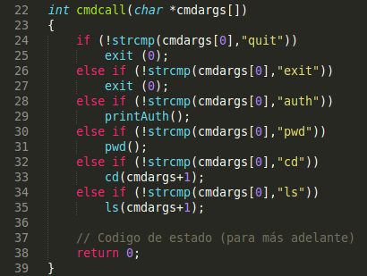 

Y por último podemos compilar y hacer alguna prueba para comprobar su buen funcionamiento: 

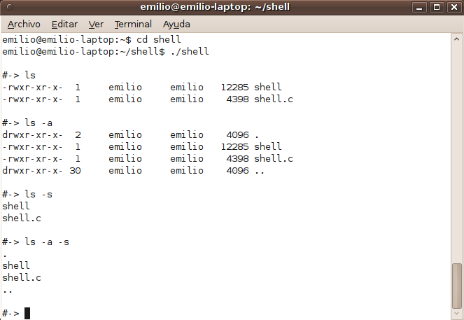