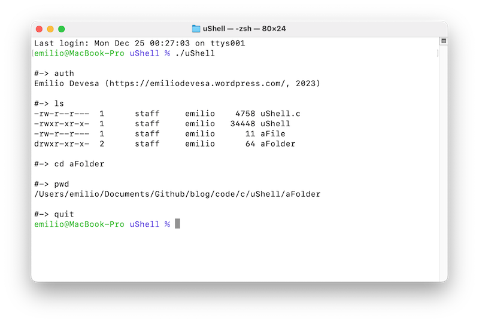
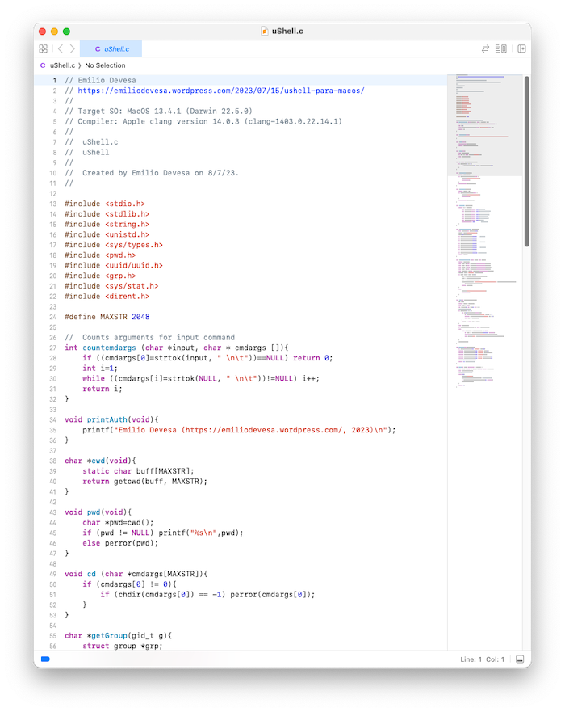

## uShell

uShell es un pequeño terminal que te permite navegar por tu estructura de directorios y listar los archivos de tu sistema de ficheros: 



Se puede compilar con la orden:
```
$ clang uShell.c -o uShell
```
Y ejecutarlo con:
```
$ ./uShell
```



uShell es la implementación de mi otro proyecto "shell" modificado para que funcione adecuadamente en MacOS.