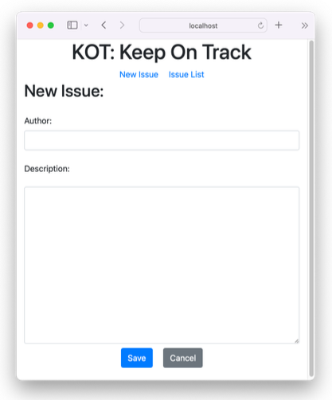
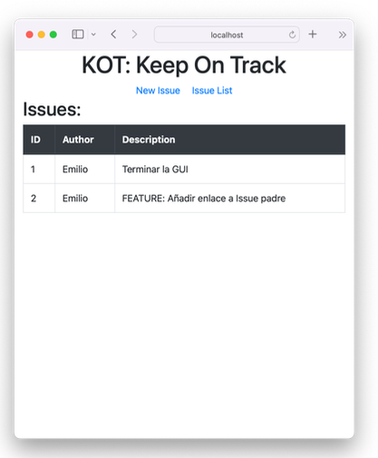

# KOT: Keep On Track
### (PFC DAM2)

The KOT app (short for Keep On Track) is a tracking tool designed to provide centralized control over all the tasks needed to successfully manage any project. Users can freely add and describe tasks, ensuring that the app adapts to their project, rather than relying on solutions tailored to a specific field of work.

Throughout the two years of the DAM program and especially during group work, we identified a need for a simple, fast, and effective tool where we could note down every obstacle we encountered, ideas we wanted to develop, or features we needed to define.

While there are other solutions on the market, such as BugTracker, they are entirely programmer-focused and not effective for managing tasks like tracking classroom performance. KOT, on the other hand, is multipurpose by design, making it useful for any user. Initially conceived as a tool for tracking bugs, functions, and code improvements, KOT can be used for many other purposes as well—such as creating lists, managing finances, tracking clients, logging activities, and more.

The end user doesn't need advanced technical skills to use the app.

In future iterations, I would like to add features such as code highlighting, multi-user support, the ability to respond to previous tasks, and the possibility of using tags to easily and quickly categorize entries directly within the app's interface.

