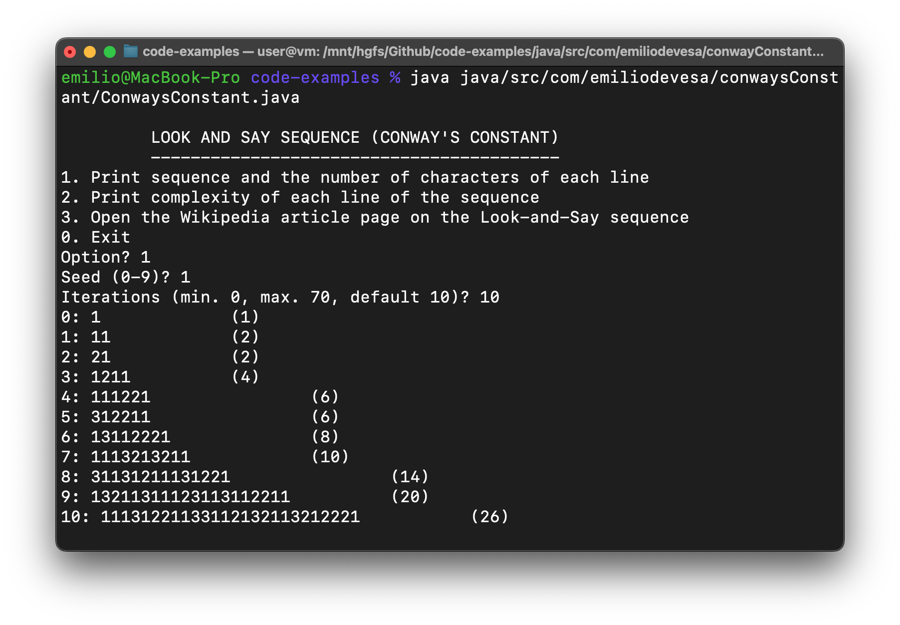
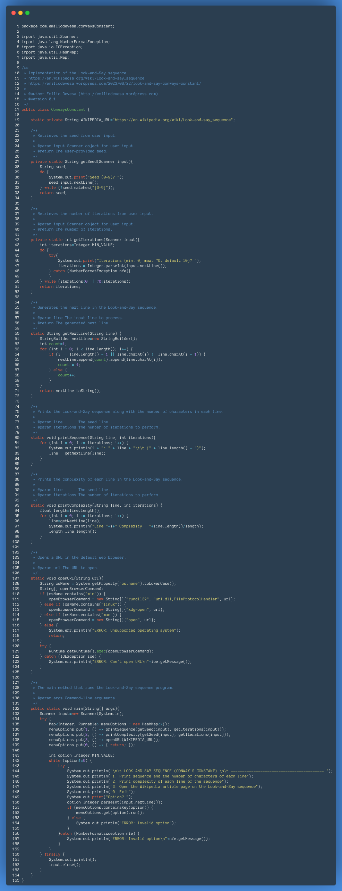
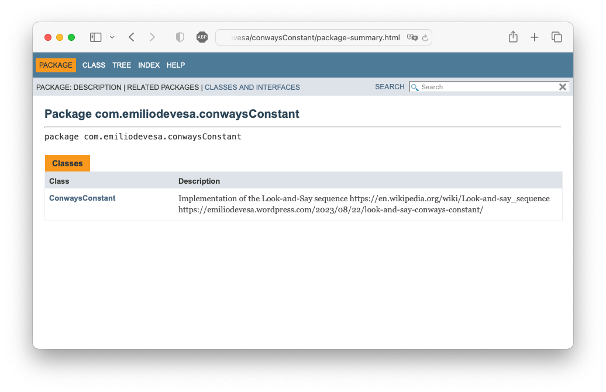

## Conway's Constant



Si eres un entusiasta de las matemáticas y la programación, es posible que hayas oído hablar de la fascinante secuencia "Look-and-Say", también conocida como "Conway's Constant". Esta secuencia es un ejemplo único de cómo los números pueden generar patrones complejos y fascinantes mediante reglas simples. En este artículo, exploraremos una implementación en Java de esta secuencia y analizaremos cada aspecto del código.

**Introducción a la Secuencia "Look-and-Say"**  
La secuencia "Look-and-Say" es una serie de números en la que cada término se forma describiendo el término anterior en términos de conteo de dígitos. Fue el matemático británico John Conway quien popularizó esta secuencia en 1986 y la simplicidad de las reglas que la definen contrasta maravillosamente con la complejidad de los patrones que produce. Su nombre proviene de la forma en que cada término se "ve" o "lee" en función del anterior. Por ejemplo, si comenzamos con el número 1, el siguiente término será "11", ya que estamos describiendo un dígito "1". El tercer término sería "21", ya que ahora tenemos "dos unos". A medida que avanzamos, los números resultantes se vuelven cada vez más complejos y sorprendentes.

**La Implementación en Java**  
He escrito un programa en Java que implementa la secuencia "Look-and-Say". Este código ofrece una forma interactiva para que el usuario explore la secuencia y visualice los patrones emergentes: 

 

Ejecución: 
```
$ java ConwaysConstant.java
``` 
Puedes generar documentación del programa «parseando» los comentarios escritos en el código si ejecutas la orden: 
```
$ javadoc ConwaysConstant.java -package -d help
```
Esto generará un directorio llamado «help» con unos cuantos archivos dentro. Si abres el archivo `index.html` en tu navegador, verás algo como esto: 



**Explorando las Opciones del Menú**  
Una característica destacada de esta implementación es la interacción con el usuario a través de un menú. El usuario puede elegir entre tres opciones: 1. Imprimir la Secuencia y la Longitud de Cada Línea: Esta opción muestra la secuencia "Look-and-Say" junto con la cantidad de caracteres en cada línea generada. 2. Imprimir la Complejidad de Cada Línea: Aquí, el programa calcula y muestra la complejidad de cada línea de la secuencia. La complejidad se calcula dividiendo la longitud de la línea actual entre la longitud de la línea anterior. 3. Abrir la Página de Wikipedia: Si deseas obtener más información sobre la secuencia "Look-and-Say", esta opción abre automáticamente la página de Wikipedia relacionada. 

**Explicación de los métodos:**  
`getSeed`: Este método solicita al usuario que ingrese una semilla para comenzar la secuencia Look-and-Say. La semilla debe ser un solo dígito entre 0 y 9. Si el usuario ingresa un valor inválido, se le seguirá solicitando hasta que ingrese un valor válido. Retorna la semilla proporcionada por el usuario como una cadena de caracteres.

`getIterations`: Este método solicita al usuario el número de iteraciones que desea realizar en la secuencia Look-and-Say. El número de iteraciones debe estar entre 0 y 70, con un valor predeterminado de 10. Si el usuario ingresa un valor inválido, se le seguirá solicitando hasta que ingrese un valor válido. Retorna el número de iteraciones proporcionado por el usuario como un número entero.

`getNextLine`: Este método toma una línea de la secuencia Look-and-Say y genera la siguiente línea en la secuencia aplicando las reglas de la secuencia. Cuenta las repeticiones consecutivas de un dígito en la línea dada y los reemplaza con el número de repeticiones seguido por el dígito. Retorna la línea generada como una cadena de caracteres.

`printSequence`: Este método imprime la secuencia Look-and-Say y muestra el número de caracteres en cada línea generada. Toma la semilla inicial y el número de iteraciones como argumentos y muestra cada línea junto con su longitud en caracteres.

`printComplexity`: Este método imprime la complejidad de cada línea en la secuencia Look-and-Say. Calcula la relación entre la longitud de la línea actual y la longitud de la línea anterior para medir la complejidad relativa. Muestra la complejidad de cada línea generada.

`openURL`: Este método intenta abrir una URL en el navegador web predeterminado del sistema operativo. Toma una URL como argumento y utiliza comandos específicos del sistema operativo para abrir la URL en el navegador correspondiente. Si el sistema operativo no es compatible, muestra un mensaje de error.

`main`: Este es el método principal del programa. Crea un menú de opciones que permite al usuario elegir entre diferentes acciones relacionadas con la secuencia Look-and-Say. Las opciones incluyen imprimir la secuencia junto con la longitud de cada línea, imprimir la complejidad de cada línea y abrir la página de Wikipedia sobre la secuencia Look-and-Say. El programa itera hasta que el usuario elige salir (opción 0). Utiliza lambdas y un mapa para asociar las opciones del menú con las acciones correspondientes.

**Complejidad**  
Si ejecutas el programa y seleccionas la opción de imprimir la complejidad de la sucesión, podrás observar que el valor de la misma tiende a 1.303577269034, un número también conocido como "Constante del Juego de la Vida" o "Constante de Conway". Conway investigó esta constante en el contexto del "[Juego de la Vida](https://es.wikipedia.org/wiki/Juego_de_la_vida)", un autómata celular bidimensional. Dado que esta constante involucra una serie infinita de exponentes anidados, no se puede expresar exactamente mediante una fracción o un número decimal finito. Por lo tanto, se utiliza su aproximación decimal para propósitos prácticos.

**Más Allá de la Pantalla: Aplicaciones y Reflexiones**  
La secuencia "Look-and-Say" no solo es un concepto matemático intrigante; también tiene aplicaciones prácticas y connotaciones interesantes en otros campos. Secuencias similares a menudo se encuentran en la naturaleza, como por ejemplo en la estructura de las moléculas de ADN. Esta similitud puede llevarnos a reflexionar sobre cómo los patrones numéricos se entrelazan con el mundo que nos rodea. También toca conceptos de teoría de la información y complejidad al examinar cómo los términos posteriores son el resultado de describir los términos anteriores de manera concisa. Esto plantea preguntas sobre cómo medir la complejidad de los términos y cómo la información se codifica y desencadena en esta secuencia. Una mirada más profunda revela conexiones con automorfismos y autómatas finitos. Los términos de la secuencia pueden ser interpretados como instrucciones para generar patrones. Esta conexión entre números y estructuras de autómatas agrega otra capa de significado y profundidad a la secuencia. Incluso si llegamos a considerar la densidad de ciertos números dentro de la secuencia... ¿Qué números aparecen con mayor frecuencia? ¿Existen números que nunca aparecen? Estas preguntas pueden conducir a explorar propiedades asintóticas y distribucionales.

**Un Desafío Abierto para los Curiosos**  
Para aquellos que deseen profundizar aún más, aquí hay un desafío abierto: ¿puedes encontrar patrones en las longitudes de las líneas de la secuencia "Look-and-Say" en relación con los números primos?

**Conclusiones**  
La secuencia "Look-and-Say" es un ejemplo intrigante de cómo una serie de números aparentemente simples puede dar lugar a patrones sorprendentemente complejos. La implementación en Java que puedes econtrar en este repositorio ofrece una forma interactiva y educativa de experimentar con esta secuencia y observar cómo evoluciona a lo largo de las iteraciones.