## Tres en raya

Implementación del juego Tres en raya (tic-tac-toe) en Java.

Al principio definiremos algunas cosas que vamos a necesitar. Nuestro tablero de juego no es más que un vector de 9 caracteres. Esas nueve casillas que representa pueden estar vacías (un espacio en blanco) o ocupadas por el carácter con el que juega el usuario (charUsuario='x') o la máquina (charMáquina='o'). También aquí tenemos los contadores de victorias y derrotas.

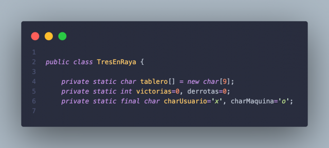 

Por otra parte, el método main es prácticamente calcado al visto en el juego del ahorcado. Simplemente muestra un menú y ejecuta las acciones pertinentes: 

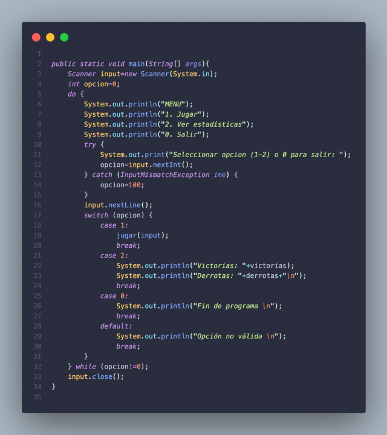 

Por supuesto importaremos las clases necesarias para el Scanner y el tratamiento de excepciones.

**El tablero**  
Para mostrar el tablero a lo largo del juego voy a desarrollar tres métodos. Al empezar una partida, quiero que se le muestre al jugador un tablero con los números de cada casilla (del 1 al 9), que son los números de casilla que introducirá por teclado para saber dónde quiere colocar sus fichas. Después, ese tablero deberá estar vacío (introduciendo caracteres ' ') para poder empezar y se mostrará su estado paso a paso conforme se vayan realizando movimientos hasta terminar la partida. 

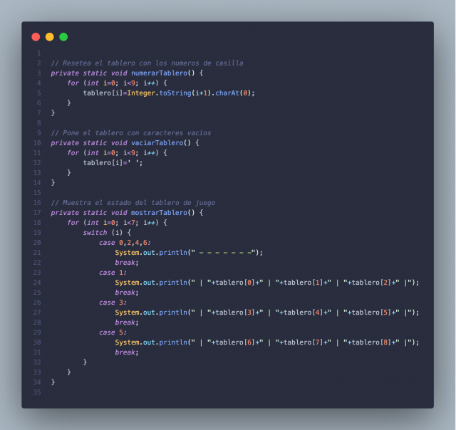 

No hay nada especial en estos tres métodos salvo convertir un número a un carácter mediante la concatenación de dos métodos:  
_Integer.toString(numero).charAt(0)_  
Prácticamente auto-explicativo.

**Desarrollo**  
He tratado el desarrollo del juego en dos métodos para hacerlo más legible. Sigo un modelo Top-Down así que el primero que veremos es "jugar()", que es el que se invoca desde la opción 1 del menú. Básicamente cuando el usuario escoge jugar, se le muestra el tablero numerado y se vacía. 

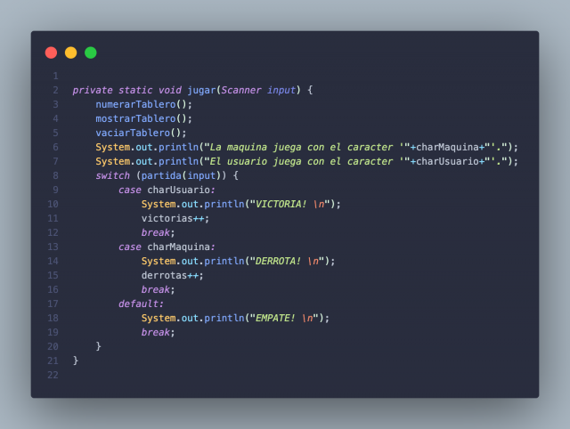 

Este método a su vez invoca a "partida()", donde se desarrolla la partida, y que devuelve un char correspondiente a quien haya obtenido la victoria o en caso de empate. Aquí se actualizan los contadores si es el caso. Ahora bien, para decidir quien empieza a colocar sus fichas he creado un método auxiliar "turnoInicial()" muy sencillo donde se sortea de forma más o menos aleatoria el turno. Requiere importar la clase Random. 

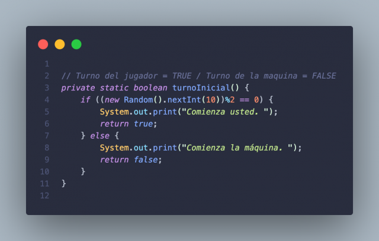 

Y ya estamos listos para comenzar la partida. El bucle de jugadas se ejecutará mientras no haya un ganador y mientras el numero de fichas introducidas en el tablero sea menor que 10. Primero mostramos el estado actual del tablero, preguntamos si aún no se han introducido todas las fichas posibles y según de quien sea el turno, introduciremos una ficha del jugador o de la máquina. En el caso de que sea turno del jugador, simplemente comprobamos que la posición indicada está vacía y le preguntamos de nuevo si no lo está. Si es el turno de la máquina, llamamos al método "ocuparCasilla()", del que hablaré más tarde. Una vez colocada la ficha, cambiamos el turno, comprobamos si hay un ganador con el método "victoria()" y aumentamos el contador de fichas ya introducidas. Una vez que el bucle acabe, mostramos el estado final del tablero y devolvemos el char correspondiente al ganador (o un carácter vacío si ha sido empate). 

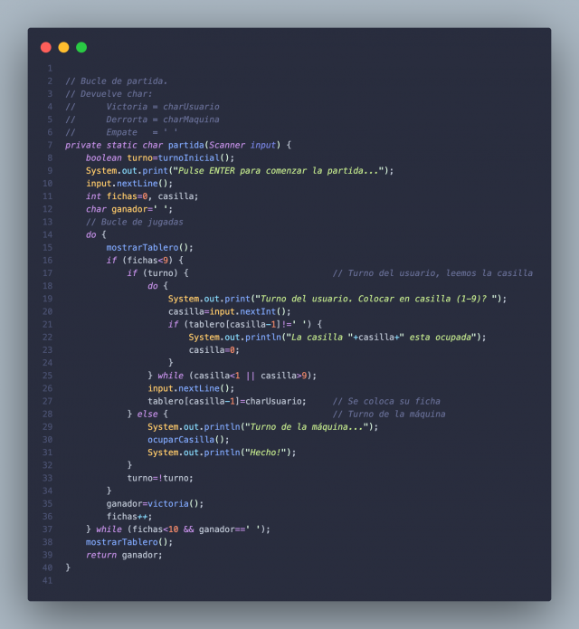

**Casillas y victorias**  
No hablo de estadísticas del Real Madrid ni de la Selección Española. ¿Como decide la máquina qué casillas ocupar para buscar la victoria? Hay varias formas sencillas de hacer esto pero me temo que ninguna satisfactoria. Buscando información en internet llegué al algoritmo [minimax](https://es.wikipedia.org/wiki/Minimax), pero no quería complicarme mucho para implementarlo. De modo que la máquina hará una serie de comprobaciones para que parezca que juega de forma inteligente cuando en realidad no lo hace. La primera y más evidente se trata de comprobar la casilla central (posición 4 del vector). Si está libre, la ocupa. Si ya estaba ocupada por una ficha suya, la máquina tratará entonces de buscar las casillas 1, 3, 5 y 7 para formar la línea central vertical u horizontal. Si después de comprobarlas, no las ha podido ocupar, entonces buscará cualquiera de las restantes simplemente iterando a lo largo de todo el vector. Si la posición central pertenece al jugador, no obstante, la máquina realiza un proceso análogo buscando jugar en los vértices del tablero, es decir, las posiciones 0, 2, 6 y 8, para formar una de las dos líneas diagonales. 

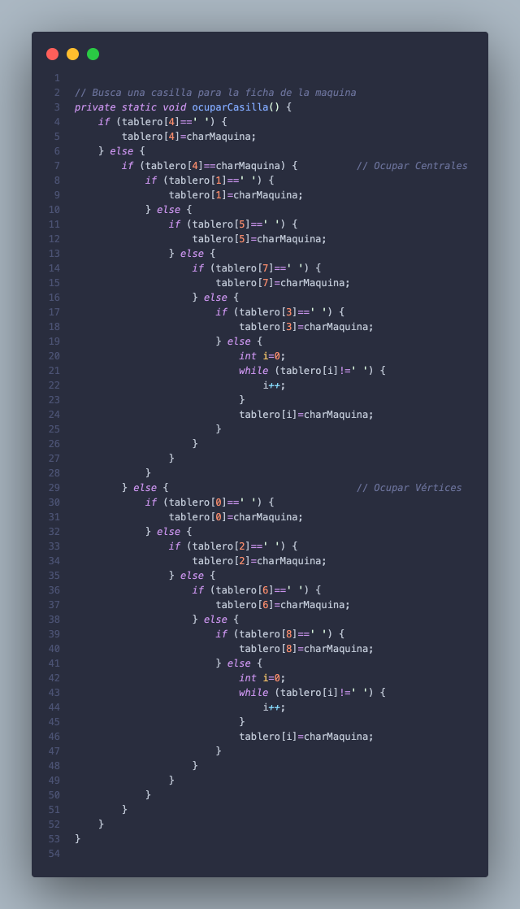 

No se trata, ni mucho menos, de una "inteligencia artificial". Más bien se trata de un "primitivo artificio intelectual".

Como después de introducir una ficha, hay que comprobar si tenemos un ganador, lo que he hecho es el método "victoria()", que simplemente aglutina una serie de comprobaciones para verificar si existen tres fichas en raya en alguna de las verticales, horizontales u oblicuas. 

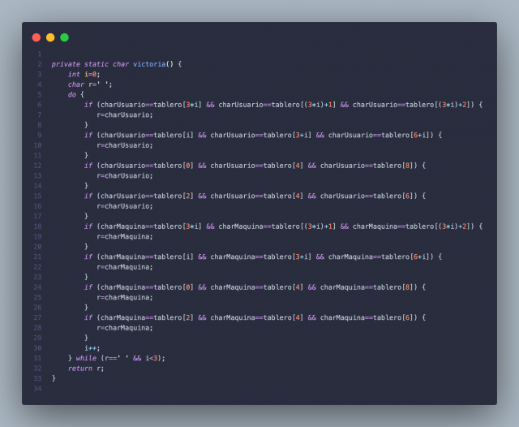 

De nuevo, es un mecanismo muy rudimentario, pero suficiente.

**Jugando**  
Compilamos con: 
```
$ javac TresEnRaya.java
```
Y ejecutamos con: 
```
$ java TresEnRaya
``` 

**Capturas de pantalla**

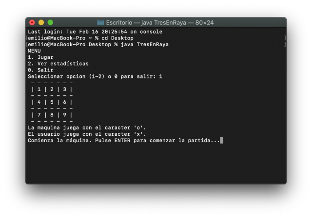 

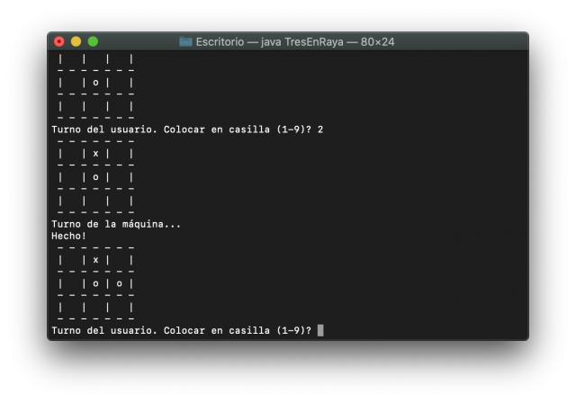 

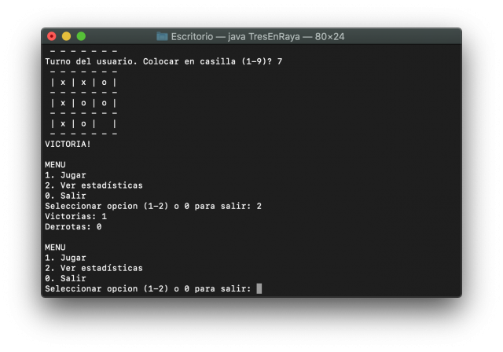 
