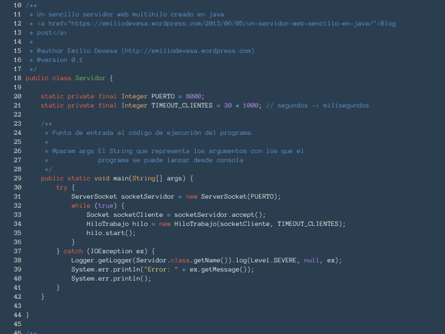
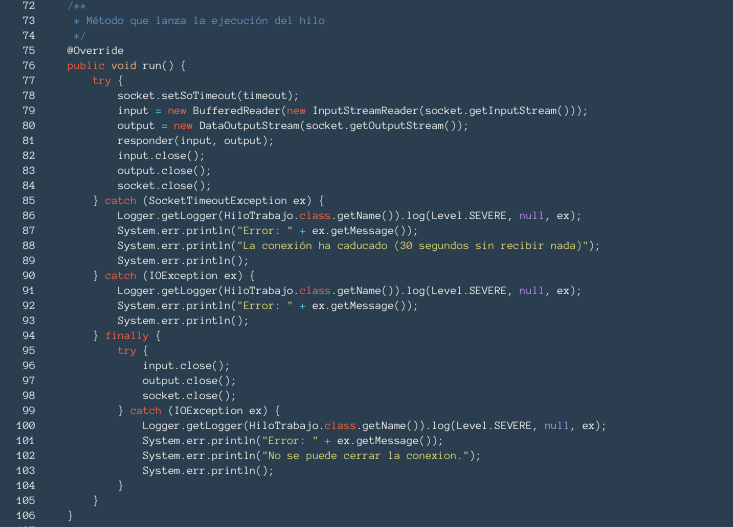
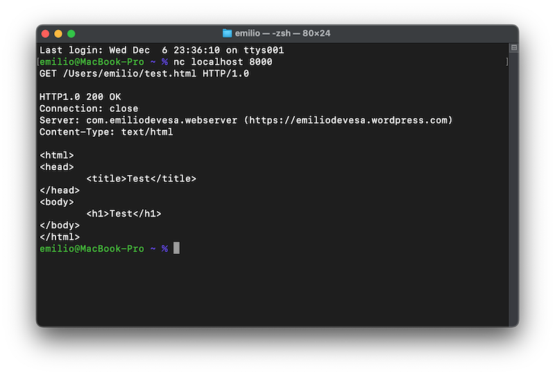

# Webserver

Servidor web sencillo en el lenguaje Java que puede responder a algunas sencillas peticiones HTTP cumpliendo lo siguiente:

- Que el servidor sea multi-thread para poder atender a varios clientes a la vez 
- Que al menos implementemos las operaciones HEAD y GET 
- Que soporte los formatos de archivo HTML, texto plano, GIF y JPEG

La clase principal es la clase "Servidor", que también es la más pequeña porque solo crea el socket del servidor y se queda esperando a que lleguen conexiones. Si una llega, abre un nuevo hilo (thread) en el que se atenderá esa petición, mientras puede esperar a que lleguen otras. Cada una se procesará por separado y así pueden ser concurrentes. Es importante destacar que el método usado para arrancar un thread sea "start()" en lugar de "run()". Lo que en realidad sucede es que "start()" ejecuta lo mismo que "run()" en un hilo aparte, mientras que "run()" lo haría en el hilo padre, bloqueando el funcionamiento del resto del programa mientras no termine sus tareas.



Hay que fijarse también en que el puerto escogido para operar no sea uno de los reservados (de 0 a 1024), yo por ejemplo seleccioné el 8000. El timeout para las conexiones es de 30 segundos.

Examinemos el método "run()" de la clase "HiloTrabajo". Aquí es donde se comenzarán a atender de verdad las peticiones de los clientes:



En él se inicializan los flujos de entrada (input) y salida (output), y se ha de vigilar que, en caso de que algo vaya mal o se alcance el límite de tiempo, los flujos se cierren, así como el socket de la conexión para que vuelva a estar libre. De ahí tanto try-catch anidado. El método responder es el que leerá el contenido de las peticiones, las discriminará según su tipo e irá generando la respuesta. Está muy documentado por ser bastante largo, aclarando además todos los pasos en las partes menos entendibles.

Aclaro que no he incluido ningún tipo de control de errores en la entrada, y el programa es muy poco tolerante con la forma en que le llegan las peticiones, pero se puede probar con facilidad. Si echas a correr el servidor puedes conectarte a él desde una terminal. Para hacer la prueba he creado un archivo "index.html" en mi home, que básicamente solo contiene la palabra "hello" y un salto de linea. Desde el terminal:
```
$ nc localhost 8000
```
Ahora no puedes ver el prompt porque estás conectado al servidor y está esperando tu petición. Si no envías nada o tardas más de 30 segundos en hacerlo, te desconectará. Como lo estoy probando en local, tengo que incluir las rutas absolutas a los archivos que solicite. Una petición válida es:
```
GET /home/edm/index.html HTTP/1.0


```
Las peticiones siempre terminan con una linea en blanco, así que tienes que pulsar Intro dos veces. Si lo haces, el servidor te responderá:



Por ahora solo están implementados los métodos HEAD y GET, así como los siguientes mensajes de control:

- 200 OK 
- 404 Not Found 
- 501 Not Implemented 

El primero será el que se devuelva cuando la petición es correcta y los datos se pueden enviar. El segundo, cuando el recurso solicitado no exista y el tercero cuando se pida algo a lo que el servidor no puede responder.
